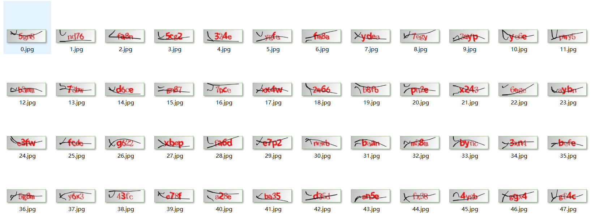

# 四川大学JW系统验证码 训练集
+ 本仓库中含有 10000 条四川大学JW系统验证码，并已经打上对应的标签

+ 可以用于深度学习的训练集，尝试构建Hack JWC的深度学习模型
+ 验证码图片存储于[IMAGES.zip](IMAGES.zip)中
+ 标签集合存于[label.csv](label.csv)中，每一行是`[图片序号, 验证码对应字符串]` 的列表，可以用Python的如下方法读取：
```python
import csv
data = []
# 读取数据
with open("label.csv", 'r', newline="" , encoding="utf8") as f:
    reader = csv.reader(f)
    for row in reader:
        data.append(row)
# 预览数据
for line in data:
    print(line)
```
序号与`IMAGES.zip`；里的文件名一一对应。

当然，如果需要进行深度学习还需要进行训练集测试集划分，随机抽取等等操作，请自行处理，祝君好运~